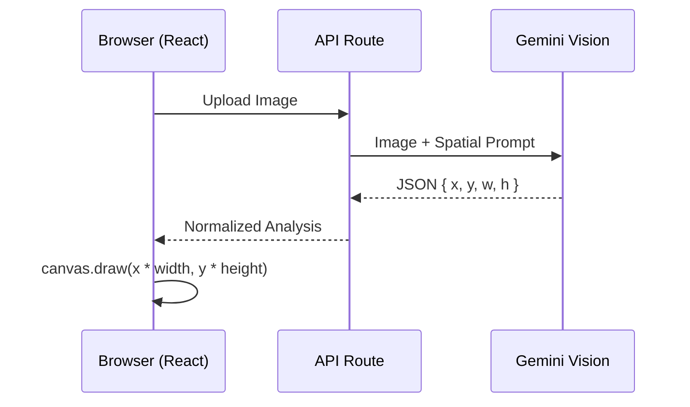

# Spatial Analysis & Bounding Boxes

This document explains how the Feng Shui Designer app detects room elements, draws bounding boxes, and estimates spatial relationships using AI.

## 1. Detection via Gemini Vision

The "brain" of the spatial mapping is the **Gemini 2.5 Vision API**. Unlike traditional object detection models (like YOLO) which just give categories, Gemini performs **Spatial Understanding**:

1.  **Image Analysis**: The room photo is sent to Gemini as a base64 buffer.
2.  **Contextual Logic**: The system prompt instructs the AI to identify specific Feng Shui "anchors" (doors, windows, primary furniture).
3.  **Normalized Coordinates**: Instead of pixels, Gemini returns positions as **normalized values (0.0 to 1.0)**.
    *   `x: 0, y: 0` is the top-left corner.
    *   `x: 1, y: 1` is the bottom-right corner.
    *   `w: 0.5` means the object spans 50% of the image width.

This normalization is critical because it ensures the mapping remains accurate regardless of whether the user is viewing the image on a phone, tablet, or desktop.

## 2. Drawing the "Spatial Map" (Canvas Overlay)

The [SpatialOverlay.js](file:///Users/ahmetyuksel/Desktop/fs/fs/components/SpatialOverlay.js) component handles the visualization using the HTML5 Canvas API:

### The Mapping Process:
```javascript
// Example of mapping normalized coordinates back to screen pixels
const pixelX = el.position.x * canvasWidth;
const pixelY = el.position.y * canvasHeight;
const pixelW = el.size.w * canvasWidth;
const pixelH = el.size.h * canvasHeight;
```

1.  **Image Sizing**: The canvas calculates the image's aspect ratio and scales it to fit the container width.
2.  **Layering**: The original image is drawn as the base layer.
3.  **Bounding Boxes**: The code iterates through the `elements` array, drawing translucent rectangles over the detected objects.
4.  **Legend Matching**: Each box color corresponds to a specific type (e.g., Green for Doors, Purple for Beds).

## 3. Measuring Distances & Relationships

### How "Distances" are Measured:
In the current version, "distance" is calculated in two ways:

1.  **Visual Proximity (Screen Scale)**: The AI calculates the distance between the `door` center and the `bed` center in the 2D coordinate space. For example, if the bed is at `x:0.8` and the door is at `x:0.1`, they are "far apart" (70% of the room width).
2.  **Heuristic Evaluation**: The system prompt explicitly defines the **Command Position** as finding the piece of furniture that is "diagonally opposite and farthest from the door." The AI uses the coordinate deltas ($\Delta X$ and $\Delta Y$) to determine if this condition is met.

### Measurement Accuracy:
> [!NOTE]
> These are **Visual Estimations**. Since humans take photos at different angles and depths, the AI uses "anchor objects" (like a standard-sized door or bed) to estimate scale and three-dimensional depth within the room's architecture.

## 4. Logical Flow Summary


